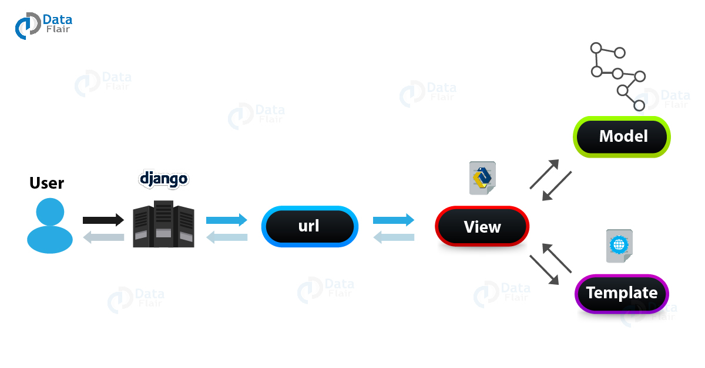

# Django란?

    

 

Django는 python을 기반으로 만들어진 무료 오픈소스 웹 프레임워크(Web application framework)이다. 

 

여기서 웹 프레임워크란?

웹 프레임워크(Web framework, WF) 또는 웹 애플리케이션 프레임워크(Weba pplication framework, WAF)는 동적인 웹페이지나, 웹 애플리케이션, 웹 서비스 개발 보조용으로 만들어지는 애플리케이션 프레임워크의 일종이다.

웹 페이지를 개발하는 과정에서 겪는 어려움을 줄이는 것이 주 목적으로 통상 데이터베이스 연동, 템플릿 형태의 표준, 세션 관리, 코드 재사용 등 웹 사이트를 개발할때 자주 사용되는 기능들을 갖춘것이다.

  

## Django는 MVT(MVC) 모델이다.

초기의 웹사이트는 데이터베이스 쿼리, 디자인 등의 각각 다른 부분을 담당하는 다양한 코드들이 하나의 파일에서 관리되었다. 그래서 잘못 누군가가 실수로 코드를 잘못 건드리면 시스템 전체에 영향을 끼치는 구조였다. 이 해결책으로 나온것이 MVC 모델이다.

    

 

 - Model : 데이터베이스 관련 로직
 - View : 웹 브라우저에 실제로 보이는 부분에 관한 로직(장고에서는 Template)
 - Control : view와 model을 이어주는 로직(장고에서는 view가 control의 역할)

