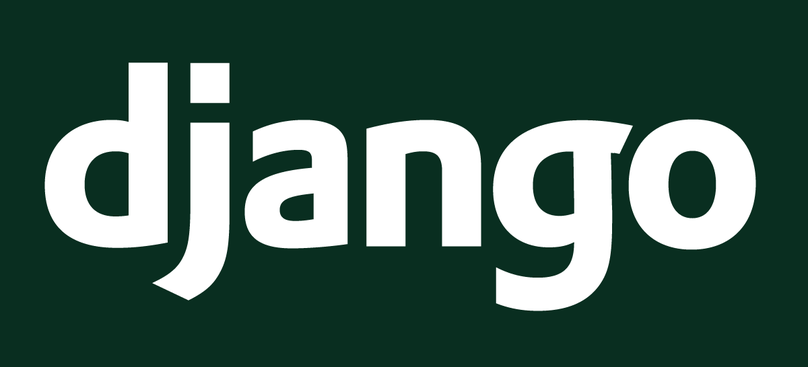

# Django란?

    

 

Django는 python을 기반으로 만들어진 무료 오픈소스 웹 프레임워크(Web application framework)이다. 

 

여기서 웹 프레임워크란?

웹 프레임워크(Web framework, WF) 또는 웹 애플리케이션 프레임워크(Weba pplication framework, WAF)는 동적인 웹페이지나, 웹 애플리케이션, 웹 서비스 개발 보조용으로 만들어지는 애플리케이션 프레임워크의 일종이다.

웹 페이지를 개발하는 과정에서 겪는 어려움을 줄이는 것이 주 목적으로 통상 데이터베이스 연동, 템플릿 형태의 표준, 세션 관리, 코드 재사용 등 웹 사이트를 개발할때 자주 사용되는 기능들을 갖춘것이다.

  

# Django 특징

## Django는 MVT(MVC) 모델이다.

초기의 웹사이트는 데이터베이스 쿼리, 디자인 등의 각각 다른 부분을 담당하는 다양한 코드들이 하나의 파일에서 관리되었다. 그래서 잘못 누군가가 실수로 코드를 잘못 건드리면 시스템 전체에 영향을 끼치는 구조였다. 이 해결책으로 나온것이 MVC 모델이다.

    

 

 - Model : 데이터베이스 관련 로직
 - View : 웹 브라우저에 실제로 보이는 부분에 관한 로직(장고에서는 Template)
 - Control : view와 model을 이어주는 로직(장고에서는 view가 control의 역할)

## 강력한 ORM기능을 지원한다.

ORM(Object Relational Mapping, 객체관계 맴핑)은 관계형 DB를 연결해주느 개념을 의미안다.

쉽게 말해서 생성한 클래스(객체)를 SQL문으로 자동 변환하여 데이터를 다루는 것이다. 이 기능 덕분에 SQL문을 사용하지 않고 DB데이터를 관리 할 수 있게 되었다. 직접 SQL 쿼리를 작성하지 않아도 파이썬 코드로 DB를 조작 가능하며 개발자가 애플리케이션 로직 작성에 집중할 수 있도록 도와 준다.

## 자체적인 템플릿을 제공한다.

Django Template을 지원하며, 템플릿 태그를 사용해 HTML 템플릿에 context로 전송된 데이터를 사용할 수 있다.  이는 동적인 페이지를 구현하는데 도움을 준다.

## 소스코드의 변경 사항을 자동으로 반영한다.

장고는 자동으로 .py 파일의 변동을 감지한다. 변경이 감지될 경우 변경 내역을 자동으로 반영해준다.

따라서 코드를 변결할 때 마다 수동으로 웹 서버를 재 시작할 필요가 없다.

