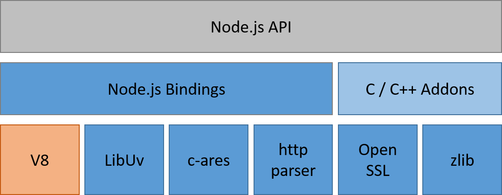

# Node.js의 아키텍쳐

 

노드는 C/C++과 자바스크립트로 만들어졌다. 대부분은 자바스크립트로 만들어 졌고C/C++은 레이어와 시스템 통합을 위해 사용되었습니다. 그리고 구글에서 만든 V8자바스크립트 엔진 위에서 동작한다. 하지만 원래 V8 엔진은 구글에서 이라는 웹 브라우저를 위해 만든 자바스크립트 엔진이기 때문에 노드에서는 V8엔진을 서버에서 동작할 수 있도록 일종의 용도 변경을 하였다.

 

V8 엔진 구조는 개발자들이 각자의 목적에 맞게 만든 노드 프로그램이 그 라이브러리 위에서 동작할 수 있게 한다. 또한 이 아키텍처에서  가장 중요한 부분 중 하나가 이벤트를 받아 처리하는 기능이다. 특히 노드는 서버 쪽에서 동작하는 프로그램을 만드는 것이 주 임무이기 때문에 기본 기능인 **소켓**이나 **HTTP 프로토콜**을 사용하여 데티어를 송수신하는 기능을 포함하고 있다.

위에 있는 사진은 초창기 노드의 아키텍처로 지금의 아키텍처와 크게 바뀌진 않았지만 기술이 발전하여 노드는 0.9버전부터는 libev의 종속성을 제거 하여 아래와 같이 libeil와 libuv로 대체하게 되었다.

 

  

## **노드 표준 라이브러리(Node standard library)**
 

실질적으로 V8과 연결되어 특정 기능들을 수행할 수 있도록 도와주는 자바스크립트 기본 라이브러리이다. 자바스크립트 언어로 작성되었고, 이를 통해 노드 바인딩과 연결된다.

  

## **노드 바인딩(Node blindings)**
 

C/C++로 구성된 시스템 바인딩 레이어이다. C/C++로 작성된 라이브러리를 자바스크립트에서 사용할 수 있도록 결합하는 핵심 요소이다. 소켓, HTTP등의 통신 기능이 제공되지만, DOM에 관한 기능은 제공되고 있지 않다.
소켓이나 http 등에 대한 노드 바인딩이 노드 표준 라이브러리와의 인터페스 역할을 합니다.

  

## **쓰레드 풀(thread pool)**
 

쓰레드풀은 libeio라는 비동기 I/O 라이브러리로 구성되어 있다. 즉 파일 관련 작업을 수행한다. 이벤트 기반이 모든 게 비동기로 동작하는 C언어용 I/O 라이브러리 이다. 파일 관련 작업이란 read, write, open, close, stat, unlink, fdatasync, mknod, readdir 등의 작업들을 말하며 모두 비동기로 처리한다. 노드에서의 비동기 입출력 작업들은 모두 이 라이브러리로 동작한다고 생각하면 된다. Node.js도 싱글 쓰레드만 사용하는 것이 아니라 내부적으로 멀티 쓰레드 풀을 사용하기는 한다.

  

## **이벤트 루프(event loop)**
 

이벤트 루프는 libev를 이용하여 구성되어 있다. 다양한 기능을 가진 고성능 이벤트 루프 라이브러리로 libevent라는 라이브러리와 유사하다. 노드의 이벤트 루프가 이것으로 구성되어 있습니다.

  

## **C-ares**
 

동시에 복수의 DNS 질의 요청을 비동기적으로 처리하기 위한 C 라이브러리이다.

