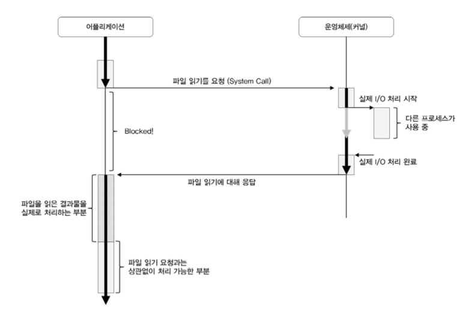
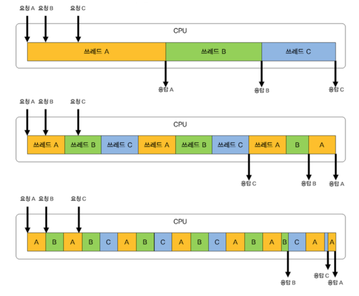

# 이벤트 기반 비동기 방식
노드가 뛰어난 성능을 발휘할 수 있는 이유는 비동기 이벤트 기반 이키텍처와 구글의 V8 자바스크립트 엔진을 이용했기 때문이다.

  

## 쓰레드 기반 vs 비동기 이벤트 기반
---
 
지금까지 재부분의 애플리케이션은 Blocking I/O를 사용하였고, 이 때문에 멀티 쓰레드 를 사용할 수 밖에 없었다. 멀티 쓰레드는 개발자 입장에서는 직관적이고 멀티 테스킹을 위해서는 어쩔 수 없는 선택이기도 하지만, 네트워크에서 동시에 대규모 요청을 동시에 처리하는 데에는 부적절하다. 

  

## Blocking I/O
---
 
일반적인 애플리케이션들은 대부분 Blocking I/O를 사용한다. Blocking I/O에 대해 자세히 설명하자면, "하나의 프로세스가 어떤 자원을 사용하고자 할 때 그 자원을 다른 프로세스가 점유하고 있다면, 그 자원의 사용을 끝마칠 때 까지 기다려야 한다는 것"을 의미한다. 운영체제를 공부해 본 사람들은 들어본적이 있을 것이다.

먼저 애플리케이션이 운영체제의 커널에게 파일을 읽기 위해 시스템 콜이라는 현태로 요청을 보낸다. 커널은 파일을 읽기 위한 동작을 수행하기 시작하고 애플리케이션은 커널이 파일을 다 읽을 때까지 기다려야 한다. 일반적으로 이 상태를 애플리케이션이 **Blocked**되었다고 표현한고 이 시간 동안 실제로 애플리케이션은 아무것도 하지 않는 상태가 된다.

  

## 멀티 쓰레드
---
 
일반적으로 하나의 프로세스가 하나의 요청에 대해 대응하고 그 일을 처리하게 되는데, 만약 웹서바와 같이 다수의 요청이 들어오게 된다면 멀티 쓰레드라는 개념을 사용할 수 밖에 없다.

 

멀티 쓰레드는 말 그대로 쓰레드 여러 개가 동시에 실행되어 요청을 처리한다는 개념이다. 이것은 CPU의 시분할이라는 개념으로 설명할 수 있다. 

시분할 개념은 하나의 CPU를 여러 프로세스 또는 쓰레도가 시간을 나누어 동작하도록 하여 마치 CPU를 공유하여 사용하는 것과 같은 효과를 낸다.
 

 
첫 번째 그림은 시분할을 이용하지 않고 싱글 쓰레드로 요청을 처리할 때의 모습이다. 먼저 들어 온 요청을 먼저 처리하고 이 요청에 대한 처리가 끝날 때까지 기다린 후에 다음 요청을 처리하는 식이다. 따라서 먼저 요청한 작업이 먼저 응담을 받을 수 있다.
 

두 번째 경우는 **단순한 프로세스 스케줄링** 을 적용한 경우로  특정 쓰레드가 인정 시간만 CPU를 사용할 수 있도록 되어 있다. 이 경우 프로세스 C가 가장 늦게 요청을 했어도 가장 먼저 응답을 받을 수 도 있다는걸 보여준다.

 

세 번째 경우는 **CPU를 사용할 수 있는 시간이 더 적게 설정** 된 경우에도 마찬가지로 먼저 요청이 온 A보다 B가 먼저 작업을 마치고 응담을 할 수도 있는 모습을 보여주고 있다. 

  

## 쓰레드로 인해 발생하는 문제
---
 

Blocking I/O 자체가 발생시키는 쓰레드 지연에 대한 문제이다. 더 쉽게 설명하자면 **I/O 요청을 하고 응답이 올때까지 아무것도 하지 않고 시간을 낭비** 한다는 문제가 있다는 것 이다.
 

다음으로는 스케즐링을 위한 처리 시간과 **문맥 전환(Context switch)** 비용이 발생한다는 것이다.

다시 말해 쓰레드를 분배햐여 사용하기 위해 사용하는 스케줄링 그 자체도 CPU를 이용한 연산이 필요한 작업이고, 쓰레드 간의 전환을 위해서는 전환하기 직전의 쓰레드를 나중에 복귀시킬 때를 대비햐여 그 상태를 저장해두어야 하는데, 이 또한 CPU를 이용한 연산이 필요한 작업입니다. 따라서 쓰레드가 많아질수록 문맥전환에 따른 성능 저하가 발생 할 수 있다.

  

## 싱글 쓰레드와 이벤트 기반의 비동기 I/O 처리
---
 

노드는 이러한 문제들을 **싱글 쓰레드와 이벤트 기반의 비동기 I/O 처리로 해결**하고 그 성능 끌어올릴 수 있도록 하는 비동기 프로개리맹 모델을 제공해주고 있다.
 

싱글 쓰레드를 가진 노드는 I/O 작업이 시작되면 I/O 작업 처리에 대한 응답을 기다리지 않고, **바로 다음 작업을 실행**해버린다. 대신 I/O 작업이 종료되면 이벤트를 발생시키고, 이 이벤트는 해당 프로세스의 이벤트 큐에 등록되게 된다. 노드로 개반된 프로세스는 이 이벤트 큐에 등록된 새로운 이벤트를 감지하여, 해당 이벤트 시 수행하여야 할 작업을 실행하게 된다.

  

## 이벤트 루프
---
 

이벤트 루프(Evenr Loop)라는 것은 닥업을 요청하면서 그 작업이 완료되었을 때 어떤 작업을 진행할지에 대한 콜백함수를 지정하여 **동작이 완료되었을 때 해당 콜백함수를 실행되는 방식의 동작 방식** 을 말합니다. 
 

만약 클라이언트가 **웹 서버에 HTTP 형식으로 요청**하게 되면 서버에서는 이벤트 루프가 계속 돌고 있다가 이를 감지하고 **알맞은 작업을 웨커 쓰레드를 생설하여 실행**합니다. 이때 이벤트 루프는 해당 웨커 쓰레드가 작업을 마친 뒤 그 결과와 함께 응답할 때까지 기다리는 것이 아니라 마로 루프로 복귀하여 다른 요청을 기다리게 된다.

