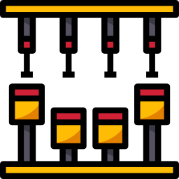

# 노드의 모듈 개념

노드에서의 모듈이라는 개념은 노드로 개발한 애플리케이션을 이루는 기본 조각이라고 할 수 있다.

쉽게 말하면 물건을 만들 때 쓰는 부품이라고 할 수 있다. 그래서 모듈은 관련된 코드들을 모아서 캡슐화해놓은 것을 모듈이라고 한다. 그리고 여러 가지 모듈을 이용하면 프로젝트를 훨씬 더 수월하게 진행할 수 있습니다.

<br>

<div align="center">
    
</div>

<br>

일반적으로 노드로 개발된 애플리케이션은 자바스크립트를 기반으로 하고, 파일과 1:1 맵핑이 되는 다양한 모듈로 구성이 된다. 이는 노드를 개발할 때 개발자가 추가하는 모듈뿐만 아니라 노드의 기능을 확장할 수 있도록 해주는 확장 모듈과 기본으로 제공하는 기능에도 해당되는 이야기 이다.

<br><br>


## 노드의 모듈화 개념

<br>

모듈은 애플리케이션을 이루는 기본 단위로, 보통 다수의 클래스와 이를 통해 생성한 객체 등으로 구성된다. 이렇게 모듈 단위로 구성된다는 것은 **객체 지향 컨셉으로 애플리케이션이 구성**된다는 것을 의미한다. 이는 노드가 **CommonJS**의 스펙을 대부분 준수하기 때문이다.

<br>

기본적으로 노드의 모듈은 자바스크립트 파일 하나와 **1:1로 맵핑**된다고 생각 하면된다. 이러한 모듈 형태는 다음 장에서 설명할 **NPM**으로 쉽게 할 수 있는 노드 확장 모듈의 개발을 평리하게 해주며, 실제 우리가 애플리케이션을 개발할 때에도 소스 코드를 깔끔하게 구상할 수 있도록 도와준다.

<br>

노드의 모듈은 **CommonJS 모듈 스펙으로부터 많은 영향을 받아 구현**되었지만 완벽하게 같진 않다. 하지만 많은 유사점이 있고 CommonJS 기반의 다른 시스템과 공유하고자 한다면 이 스펙에 대해 이해하고 있는 것이 도움이 된다.

<br><br>

## 전역 객체의 개념

<br>

전역 객체는 어디에서나 사용할 수 있는 객체를 말한다. 클라이언트 자바스크립트에서는 **Window**나 **Document**와 같은 객체를 전역 객체라고 한다.
그리고 **서버 사이드에서 동작하는 노드**의 경우에는 **"Global"**이라는 전역객체가 존재하고 있는데, 여기에는 우리가 앞으로 모듈을 불러올 때 사용할 **require()**을 비롯한 **setTimeout(), console.log()**등을 포함하고 있다.

<br>

```JavaScript
require(‘./module’)
global.require(‘./module’)
```

<br>


