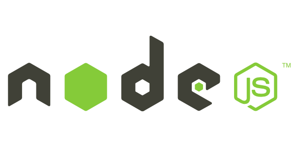

# 🐱‍🏍Node.js 란?

    

Node.js는 Chrome V8 JavaScript 엔진으로 빌드된 서버사이드 자바스크립트이며 **런타임** 입니다. 
> 런타임이란 특정 언어로 만든 프로그램을 실행할 수 있는 환경

Node.js와 관련된 핵심키워드는 아래와 갔습니다.
 - 구글 V8 자바스크립트 엔진
 - 고성능 네트워크 서버
 - 단일 쓰레드(Single Thread), 이벤트 루프(Event Loop)기반
 - 비동기 I/O처리(Non-blocking I/O)
 - 자바스크립트
 - 개발 생산성 향상
 - 방대한 모듈 제공(NPM)

  

## ✨이벤트 기반
노드는 V8과 더불어 Libuv라는 라이브러리 사용한다.

Libuv 라이브러리는 노드의 특성인 이벤트 기반, 논 블로킹 I/O 모델을 구현하고 있다.

이벤트 기반(Event-driven)이란 이벤트가 발생할 떄 미리 지정해둔 작업을 수행하는 방식을 의미 한다.

즉, 이벤트 기반 시스템에서는 특정 이벤트가 발생할 때 무엇을 할지 미리 등록해두고, 이를 이벤트 리스너에 콜백함수를 등록한다.

이후 이벤트가 발생하면 리스너에 등록해둔 콜백함수를 호출하며, 이벤트가 끝난 후 노드는 다음 이벤트가 발생할 때까지 대기한다.

그리고 Non-Blocking I/O를 지원하기 때문에 비동기식 프로그래밍이 가능하다.
이 때문에 I/O부하가 심한 대규모 서비스 개발에 적합하다.

  

## ➰이벤트 루프
이벤트 루프(Event-loop)는 여러 이벤트가 동시레 발생했을 때 어떤 순서로 콜백함수를 호출 할지를 이벤트 루프가 판단한다.

노드는 이벤트가 종료될 때까지 이벤트 처리를 위한 작업을 반복하므로 루프(loop)라고 부른다.

    

  

## 🚫논 블로킹 I/O
이벤트 루프를 잘 활용하면 오래 걸리는 작업을 효율적으로 처리할 수 있다. 작업에는 두 가지 종류가 있는데 동시에 실행될 수 있는 작업과 동시에 실행될 수 없는 작업이다. 특히 파일 시스템 접근, 네트워크를 통한 요청 작업은 I/O의 일종이며, 이러한 작엄을 할 때 노드는 논 블로킹 방식으로 처리한다.

**논 블로킹** 이란 이전 작업이 완료될 때까지 대기하니 않고 다음 작업을 수행하는 것을 의미한다.

반대로 블로킹은 이전 작엄이 끝나야만 다음 작업을 수행한다.

  

## 🎫싱글 스레드
이벤트 기반, 논 블로킹 모델과 더불어 노드를 설명하는 키워드 중 하나는 **싱글스레드** 이다.
자바스크립트 코드는 동시에 실행될 수 없는데 그 이유는 노드가 싱글 스레드 기반이기 때문이다.

- **프로세스** : 운영체제에서 할당하는 작업의 단위이다. 노드나 웹 브나우저 같은 프로그램은 개별적인 프로세스이다. 프로세스 간에는 메모리 등의 자원을 공유하지 않는다.
- **스레드** : 스레드는 프로세스 내에서 실행되는 흐름의 단위이다. 프로세스는 스레드를 여러 개 생성해 여러 작업을 동시에 처리할 수 있다. 스레드들은 부모 프로세스의 자원을 공우한다. 같은 주소의 메모리에 접근 가능하므로 데이터를 공유할 수 있다.

  

# NodeJS의 프레임워크

## 1. Express.JS  
    -   프레임워크 중 점유율 1위
    -   정보가 많고 이용자도 많지만, 속도가 느려 고성능(하이 퍼포먼스)을 요구하는 개발에 부적합하고, js비동기 처리기능, 제너레이터 함수, async/await에 대응하지 않아 수정이 필요하다.
## 2. Koa.JS
    -   제작자가 개발하는 실질적인 Exprss.JS 다음 버전
    -   Express.JS 보다 속도가 빠르고 Fastify보다 점유율이 높음. 2개 사이에 위치한 프레임위크. V1에서 제너레이터 함수, V2에서 async/await지원이 된다.
## 3. Fastify
    -   프레임워크 중 성능이 가장 높음
    -   점유율이 낮고 정보도 적지만, 성능이 가장 좋고, async/await도 대응한다. JSON Schema에 의한 검증 기능도 있고, 포퍼먼스(성능)을 강조하다 보니 비교적 세밀한 기능이 많다.

  

## TypeScript 대응 

Type Script는 Microsoft에서 개발한 Java Script의 메타 언어로 자료형 등이 추가 된다.

Express.JS  | ○

Koa.JS      | △ 플러그인 지원

Fastify     | ○

  

## 라우터 기능

많은 API를 만들 것으로 예상 되어서 쉽게 관리 할 수 있는 기능이 필요하다.

Express.JS  | ○

Koa.JS      | △ 플러그인 지원

Fastify     | ○

  

## 비동기 처리 지원

DB 접속 등으로 대기가 발생하는 상황에서 콜백 함수 여러개를 함께 사용하거나, 별도로 분리해 정의해도 코드가 너무 복잡해 이해하기 어려울 수 있다.
그래서 async / await처럼 시각적으로 흐름을 파악할 수 있는 기능이 필요하다.

Express.JS  | X

Koa.JS      | ○ v1까지는 제너레이터 함수만, v2에서 async / await 대응

Fastify     | ○ async/await 대응

  

## 검증(Validation)

기능 수신 데이터의 형식과 값을 쉽게 확인하고 Type Script 형식 정보와 함께 데이터의 불일치를 막기위해 필요하다.

Express.JS  | △ 플로그인 지원

Koa.JS      | △ 플러그인 지원

Fastify     | ○ JSON Schema에 의한 검증

