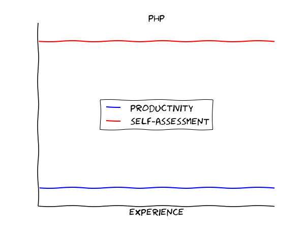
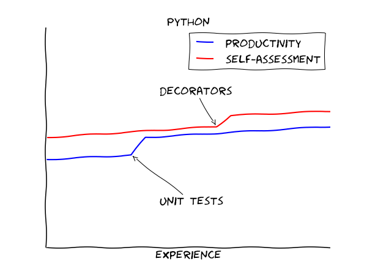
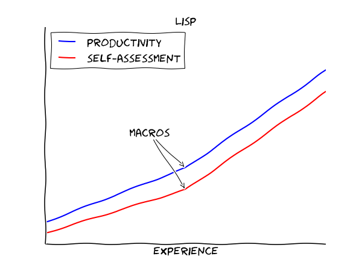

# 러닝 커브(Learning Curve) 란?

러닝 커브란 무언가를 습득하는 데 드는 시간(학습비용)을 말한다. 새로운 기술을 배울 때 처음에는 더디다가 어느 지점을 지나면 배울메 가속도가 붙고, 다시 더뎌지는 것을 곡선으로 표현한 것 이다.
  
러닝 커브는 개개인마다 다르고, 프로그래밍 언어별로 다르다.

 

빨간색 : 체감 학습량 
파란색 : 실제 생산성

 

C++ 

 
JAVA
 

 
JAVASCRIPT
 

 
PHP
 

 
PYTHON
 

 
LISP
 

 
HASKELL
 
