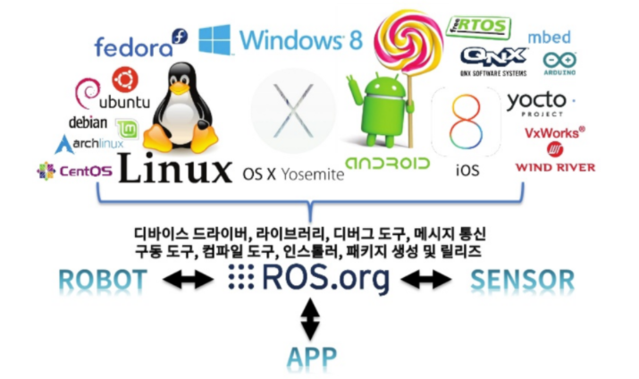
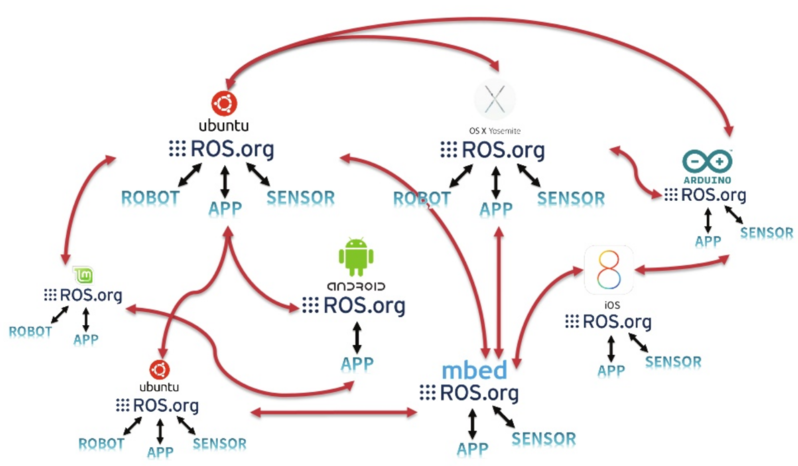
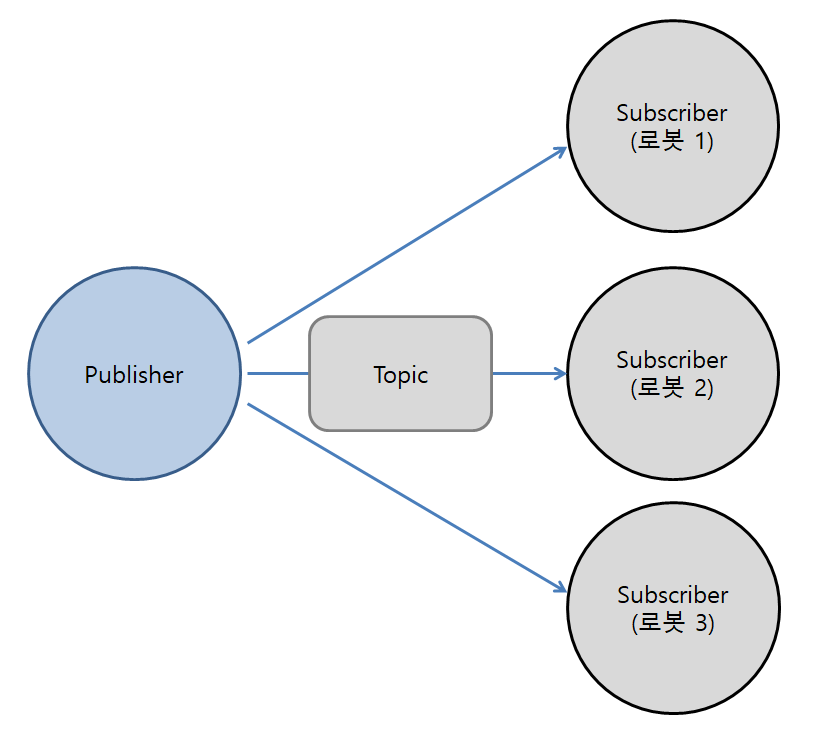
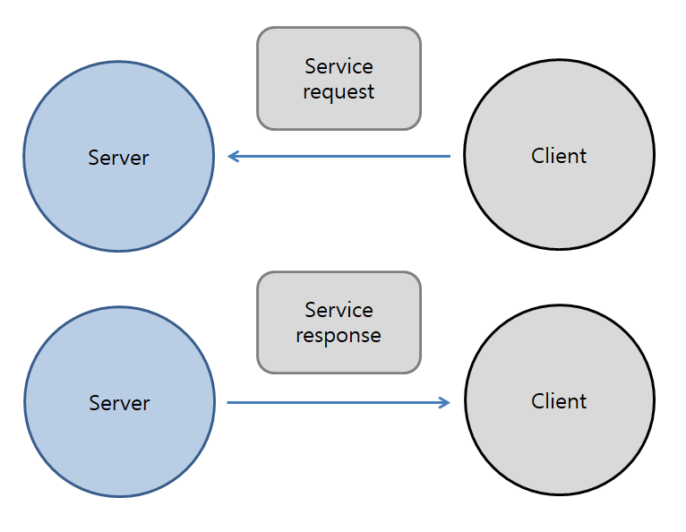
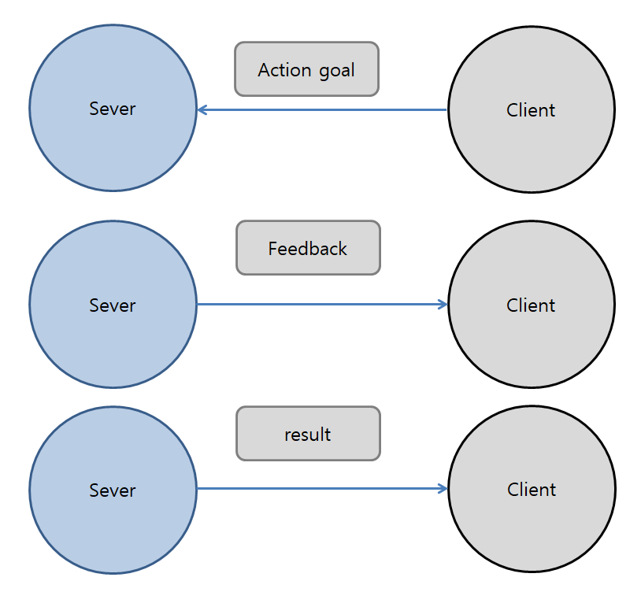

## 🤖 ROS란?
ROS는 Robot Operating System의 약자이다. 직역하자면 로봇운영 시스템이라고는 하지만 OS가 아닌 로봇용 공개소스 *메타운영체제 (Meta operating sysetem*)이다.

*메타운영체제 (Meta operating sysetem*)는 응용 프로그램을 개발하기 위해 스케쥴링 및 로드, 감시, 에러 처리 등을 실행하는 시스템을 의미한다.

즉 ROS는 로봇응용 프로그램을 개발하기 위한 운영체제와 같은 로봇 플랫폼이지만, 기존의 윈도우, 리눅스, OS X와 같은 운영체제가 아니며 기존운영체제에 추가적인 설치되어 사용된다. 그러므로 기존 OS를 기반으로 스케줄링, 파일 시스템, 프리세스 관리 등을 사용할 수 있다.

ROS는 로봇 응용 소프트웨어에 필요한 필수 기능들을 라이브러리 형태로 제공하고있다. 그리고 로봇 프레임 워크를 기반으로 응용 패키지를 개발, 관리, 제공하고 있다.

    

ROS의 데이터 통신은 하나의 운영체제에서도 수행가능 하지만 서로 다른 운영체제 하드웨어 시스템에서도 데이터를 주고 받을 수 있어 로봇개발에 매우 적합하다.

    

 

## 🦾ROS의 목적
ROS는 위에서 말했듯이 서로 다른 운영체제에서 사용할 수 있기 때문에 로봇 소프트웨어 공동 개발 생태계를 만들자는 것 이다.
그래서 로봇 연구 개발에 있어서 코드 재사용을 편리하게 하는 목적이 있다.

## 🦿ROS의 기능

### 1. 통신기능
ROS는 노드를 통해 topic혹은 service를 이용하여 데이터를 통신한다.

### **Topic (Publisher/Subscriber)**

Pubilsh/Subscribe는 단방향 메시지 송수신 방식의 topic을 사용한다.

* 단방향, 비동기 통신
* 퍼블리셔(publisher) : 메세지 송신
* 서브스크라이버(scbscriber) : 메세지 수신에 이용
* 지속적으로 발생하는 센서 데이터에 적합
* 1:n, 1:1, n:1, n:n 전부 통신 가능
> 1. CMakeLists.txt File 수정
> 2. Msg파일 작성
> 3. Publisher 노드 작성
> 4. Subscrider 노드 생성
   
#### **Service (Server/Client)**

Server/Client는 양방향 메시지 요청(request)/응답(response) 방식의 service를 사용한다.

* 양방향, 동기 통신
* 서비스 서버, 서비스 클라이언트간 통신
* 클라이언트 요청이 있을때 만 서버에서 응담
* 요청과 응답이 끊기면 노드 접속 끊김
> 1. CMakeLists.txt File 수정
> 2. Srv파일 작성
> 3. Service 노드 생성
> 4. Client 노드 생성

#### **action (Goal, Feed, Result)**

* 양방향, 비동기 통신
* 요청 중간 피드백이 필요한 경우 사용
* 해당 되는 못표 Goal과 결과 Result 피드백 Feedback
* 메세지 전송 방식 자체는 비동기식인 토픽과 동일

> **Roslaunch**

* 로봇은 하나의 노드만으로 이루어져 있지않고, 다량의 노드들의 통신으로 이루어져있다.
* 그런 다량의 노드들을 일일히 실행해야하는 수고로움을 덜어주기 위해서 생긴 방법이 roslaunch다.
* roslaunch는 XML형식으로 구성되어 있고, 아래와 같이 실행하고자하는 노드들을 선언해주면 된다.

### 2. 로봇, 센서와 관련된 기능
* standard message : 카메라, IMU 등
* gedometry libraries : TF(TransFormation, 좌표변환)
*  robot description
*  diagnose system
*  sensing/recognition
*  navigation
*  manipulation

### 3. 개발의 편의를 위한 툴
* command line tool : GUI없는 ROS command
* Rviz
* Rqt
* Gazebo

## 🎮ROS의 특징
1. 분산 프로세스 : 프로세스가 독립적으로 실행되면서 유기적으로 데이터를 주고 받을 수 있다.
2.  패키지 단위 관리 : 같은 작업을 수행하는 여러개의 프로세스를 채키지 단위로 관리가능하여 개발 또는 사용이 편리하고 배포, 공유, 수정에 용이하다.
3.  공개 리포지토리 : 개발자는 Github등에 프로젝트를 공개하고 라이센스를 밣히게 되어 있다.
4.  API형태 : API를 불러오고 적용하는 것이 가능하다.
5.  언어의 자성성 : Python, C++ Lisp, Java, C#, Lua, Ruby등 다양한 언어를 지원한다.
6.  대규모 실행 : ROS는 대규모 시스템 및 개발 프로세스에 적용 가능하다.
7.  쉬운 테스트 : ROS는 rostest라고 하는 단위/통합 테스트 프레임웍 기반 위에 있는데, 설치 및 제거가 아주 쉽다.

