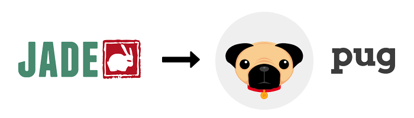

# 🐶pug란?

<div align = "center">
    
</div>

<br>

pug란 express에서 지원하는 유명한 템플릿 엔진 중 입니다. 다른 하나는 ejs로 ejs는 태그에 부분적으로 입력 및 수정을 하는 방식으로 html 문법에 익숙한 사람들에게는 적응하기 쉽다. pug는 코드를 간소화 시켜서 컴파일한 후에 html을 렌더링하는 방식이라 생산성이 높지만 문법을 익히는 데 시긴이 좀 더 걸릴 수도 있다.

pug의 원래 이름은 jade였지만 저작권 문제로 인해 pug로 변경되었다. jade로 쓰인 기간이 pug로 있던 기간 보다 길었기 때문에 jade로 더 널리 알려져 있다.

<br>

## 사용방법

pug 문법

```pug
html
    head
    body
```

html 문법

```html
<html>
    <head>
    </head>
    <body>
    </body>
</html>
```

pug는 python과 비슷하게 계층 구조를 표현하는데 html의 닫는 태그 대신에 들여쓰기로 계층구조를 표현한다. 여기서 반드시 지켜야 할점은 들여쓰기의 단위가 반드시 통일이 되어야 한다.

<br>

EX)
```pug
extends layout

block content
    h1= title
    p Welcome to #{title}
```
