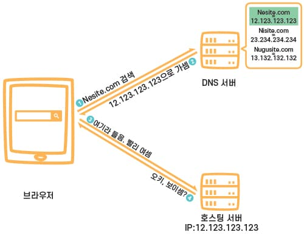
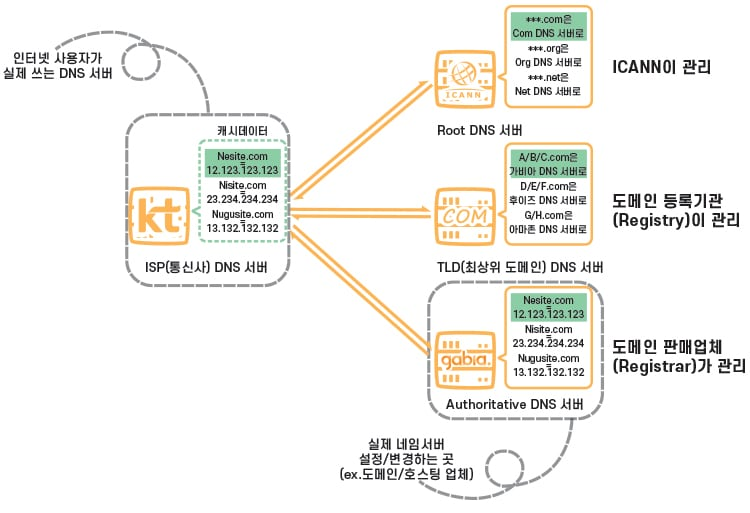

# DNS(Do Main Systme)란?

DNS는 범국제적인 단위로 웹사이트의 IP주소와 도메인 주소를 이어주는 환경/시스템이다. 그리고 이안에서 부분적으로 자신의 역할을 하는 서버를 풀네임으로 DNS서버 라고 하고, DNS 서버, 네임 서버, 도메인 네임서버 등 여러가지 이름으로 불린다.

 

## DNS의 동작원리

웹사이트의 데이터가 저장되어 있는 호스팅 서버는 인터넷 회선이 연결된 컴퓨터/장치여서 **IP 주소**가 할당되어 있고 이 주소가 실제 웹사이트의 주소라고 할 수 있다. DNS서버는 이런 IP주소를 특정 도메인 주소와 같다는 기록을 저장해 두고 인테넷 사용자들이 도메인 주소를 검색했을떄 IP주소로 연결되도록 해준다.

    

 

## DNS 서버 종류

물론 DNS서버가 하나면 위의 내용만 알고있으면 되지만 그렇지 않고, 웹 사이트마다 DNS가 있어서 힘들다. 그래서 무수히 많은 DNS서버가 있기 때문에 DNS 서버 종류를 계층화해서 단계적으로 처리를 한다. 특히 도메인 총 관리는 ICANN에서 하기 때문에 DNS서버도 최상위 도메인에서 개인 도메인의 개인 도메인 까지 도메인 이름의 분류와 마찬가지로 디렉토리/계층 형태로 구분된다고 생각하면 쉽다.

    

 - Root DNS Server: ICANN이 직접 관리하는 최상위 서버로, TLD DNS 서버 IP들을 저장해두고 안내하는 역할을 함.
 - TLD(최상위 도메인) DNS Server: 도메인 등록 기관(Registry)이 관리하는 서버로, Authoritative DNS 서버 주소를 저장해두고 안내하는 역할을 함. 어떤 도메인 묶음이 어떤 Authoritative DNS Server에 속하는지 아는 이유는 도메인 판매 업체(Registrar)의 DNS 설정이 변경되면 도메인 등록 기관(Registry)으로 전달이 되기 때문임.
 - Authoritative DNS Server: 실제 개인 도메인과 IP 주소의 관계가 기록/저장/변경되는 서버. 그래서 권한의 의미인 Authoritative가 붙음. 일반적으로 도메인/호스팅 업체의 ‘네임서버’를 말하지만, 개인 DNS 서버 구축을 한 경우에도 여기에 해당함.
 - Recursive DNS Server: 인터넷 사용자가 가장 먼저 접근하는 DNS 서버임. 위 3개의 DNS 서버를 매번 거친다면 효율이 안 좋아지기 때문에, 한 번 거친 후 얻은 데이터를 일정 기간(TTL/Time to Live) 동안 캐시라는 형태로 저장해 두는 서버임. 직접 도메인과 IP 주소의 관계를 기록/저장/변경하지는 않고 캐시만을 보관하기 때문에, Authoritative와 비교되는 의미로 반복의 Recursive가 붙음. 대표적인게 KT/LG/SK와 같은 ISP(통신사) DNS 서버가 있고, 브라우저 우회 용도로 많이 쓰는 구글 DNS, 클라우드플레어와 같은 Public DNS 서버가 있음

