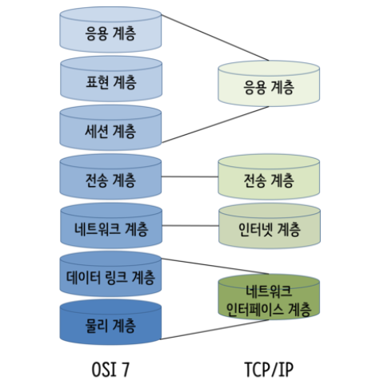
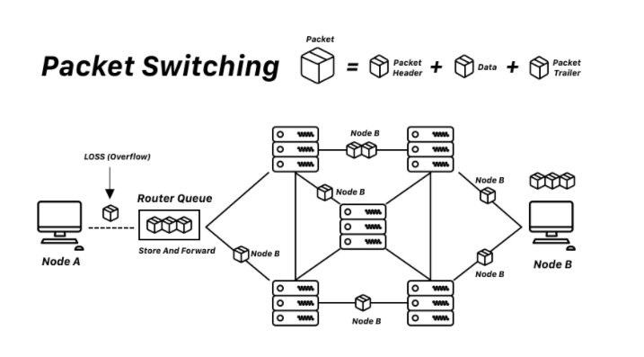

# 🌎Internet

인터넷은 프로토콜 스위트(Suites)를 기반으로 하는 컴퓨터 네트워크 입니다.
인터넷 프로토클 스위트란, 인터넷이서 단말간 서로 정보를 주고받는 데 쓰이는 돝신규약(프로토콜)의 집합 입니다.
 
인터넷 프로토클 스택은 OSI 7계층과 달리, 4계층 (또는 5계층)으로 구분 합니다

1,2 네트워크 인터페이스 계층 :  Ethernet, Wi-Fi, 토큰링, PPP, 프레임 릴레이, SMDS … 
3 인터넷 계층 IP (IPv4, IPv6) 
( 2.5 ARP ARP, RARP ) 
4 전송 계층 :  TCP, UDP … 
5 응용 계층 :  DNS, TLS/SSL, FTP, HTTP, IMAP, IRC, SMTP, SSH, 텔넷, 비트토렌트, RTP … 

## 📬패킷 교환방식(Packet_Swithing)

> 

TCP/IP환경에서 데이터는 패킷이라는 단위로 교환됩니다.

작은 블록의 패킷으로 데이터를 전송하며 데이터를 전송하는 동안만 네트워크 자원을 사용하도록 사용하는 방법입니다.

이렇게 패킷단위로 데이터를 교환하는 방식을 직관적으로 패킷교환 방식 이라고 합니다.

이 패킷 교환 방식에 축적교환방식(Store and Forward)을 사용하는데
송수신 강호간에 직접적인 접속경로(회선 점유)를 만들지 않고 통신 정보를 중삭 노드(스위치, 라우터) 등의 기억 캐체를 활용하여 경우하게 됩니다.

이에 따라  중계 루트가 변하는 형태로 상대방에게 전송 됩니다.

이러한 방식의 이점은 아래와

* 네트워크 자원을 패킷 단위로 나누어 시간을 공유하므로 회선 효울성이 높습니다.
* 전송 대역(bandWidth)를 효율적으로 사용할 수 있습니다.
* 패킷 단위로 데이터의 흐름이 생기고, 패킷에 우선 순위를 지정할 수 있습니다.
*  패킷 교환망은 Store-and-Forward 방식을 사용하기 때문에 데이터가 들어오는 속도와 나가는 속도를 맞출 필요 없이 각 스테이션에 맞도록 속도를 조절할 수 있습니다. 이로써 전송 지연이 줄어들고 통신 안정성이 늘어납니다.

## IP (Internet Protocol)

컴퓨터와 컴퓨터간에 데이터를 전송하기 위해서, 각 컴퓨터의 주소가 필요합니다. Internet Protocol은 4바이트로 이루어진 컴퓨터 주소이며, **192.168.9.255**와 같이 3개의 마침표로 나누어진 숫자로 표시된다. IP는 TCP와 달리 데이터릐 재조합이나 손실여부 확인이 불가능하고 오직 호스트간의 통신만을 담당한다.

 

### 종류

1. 외부 IP(공인 IP)
    
    아무것도 

