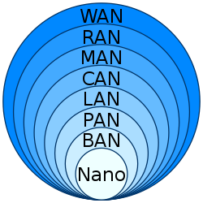
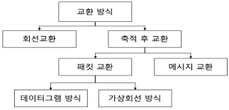

# 네트워크 (Network)란
 

Net + Work 의 합성어로써 컴퓨터들이 통신 기술을 이용하여 그물망처럼 연결된 통신 이용 형태를 의미한다.

**IEEE(Institute of Electrical and Electronics Engineers)** 국제 전기 전자 공학회)에서는 네트워크를 "몇 개의 독립적인 장치가 적절한 영역내에서 적당히 빠른 속도의 물리적 통신 채널을 통하여 서로가 직접 통신할 수 있도록 지원해주는 테이터 통신 체제" 라고 정의했다. 

링크를 통해 서로 간의 회선과 패킷을 교환함으로 데이터 통신을 한다.

  

## 네트워크의 장 단점
 

### **장점**
 

 - 네트워크의 장점은 우리는 파일공유를 통해 다른 네트워크에 있는 컴퓨터 파일에 접근할 수 있다.
 -  미디어 스트리밍으로 사진, 음악, 비디오 등의 디지털 미디어를 네트워크를 통해 재생할 수 있다.
 -  광대역 인터넷 연결을 공유할 수 있게되어 각 PC마다 별도의 인터넷 계정을 구입할 필요가 없다.
 -  인터넷에서 다른 사람과 만나 PC, 게임 콘솔 등을 통해 네트워크 게임을 즐길수 있다.
 -  유선으로 책상에서만 PC 작업을 해야 한다는 제약조건이 있다면 무선전파를 이용한 무선 네트워크로 책상에서 벗어나 웹작업을 할수 있다는 큰 장점을 가지게 된다.

 

### **단점**
 

 - 바이러스나 악성코드, 윈치않는 정보를 받게 된다.
 - 해킹으로 인한 개인 정보 유출 등 네트워크에 다양하고 많은 단말기들이 연결되어지므로 보안상 문제점이 생기게 된다.
 - 데이터 변조가 가능하다.

  

## 영역별 컴퓨터 네트워크 종류

    

 - 광역 통신망(Wide Area Network)
 - 무선 접속 네트워크(Radio access network)
 - 도시권 통신망(Metropolitan area network)
 - 캠퍼스 통신망(Campus Area Network)
 - 근거리 통신망 (Local Area Network)
 - 개인 통신망 (Personal Area Network)
 - 인체 통신망 (Body Area Network) 

  

## 네트워크의 회선구성 방식
 

회선 구성 방식이란 여러대의 단말기들을 연결하는 방식을 말한다.

 - 포인트 투 포인트(Point-to-Point) 방식 : 중앙 컴퓨터와 단말기를 일대일로 연결하여 언제든지 데이터 전송이 가능하게 한 방식
 - 멀티 드롭(Multi-Drop) 방식  : 멀티 포인트 방식이라고도 하며 다수의 단말기들을 한개의 통신 회선에 연결하여 사용하는 방식이다.
 - 회선 다중 방식(Line Multiplexing) : 회선 다중방신은 다중화 방식이라고도 한다. 여러대의 단말기의 다중화 장치를 활용하여 중앙 컴퓨터와 연결하여 사용하는 방식이다.

  

## 네트워크 데이터 교환 방식
 

 

 - 회선 교환 방식 : 회선 교환 방식은 통신을 원하는 두 지점을 교환기를 이용하여 물리적으로 접속시키는 방법을 말한다.
 - 공간 분할 교환 방식 : 기계식 접점과 전자교환기의 전자식 접점 등을 이용하여 교환을 수행하는 방식이다.
 - 시분할 교환 방식 : 전자부품이 갖는 고속성과 디지털 교환 기술을 이용하여 다수의 디지텅 신호를 시분할적으로 동작시켜 다중화하는 방식이다.
