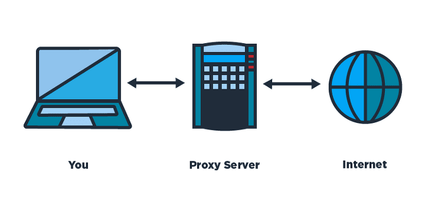

# 프록시(Proxy) 서버란?

프록시 서버란 클라이언트가 자신을 거쳐 다른 네트워크에 접속할 수 있도록 중간에서 대리해주는 서버이다. 서버와 클라이언트 사이에서 대리로 통신을 수행해주는 것을 프록시라고 하고 그 기능을 하는 서버를 프록시 서버라고 한다. 그리고 시스템에 방화벽을 가지고 있을 때 외부와의 통신을 위해 만들어 놓은 서버이다.

    

 

# 프록시 서버의 특징

프록시 서버는 클라이언트와 서버의 입장에서 볼때 서로 반대의 역할을 하는 것처럼 보여지게 된다. 클라이언트가 프록시를 바라보면 프록시가 **서버**와 같이 동작을 하게 되고, 반대로 서버가 프록시를 바라보면 **클라이언트** 처럼 동작하게 된다.

프록시를 사용하는 이유는 단순히 보안 때문만은 아니다. 프록시는 프록시 서버에 요청이 된 내용들을 **캐시**를 이용하여 저장해 둔다. 이렇게 캐시로 저장 해 두게 된다면 다시 데이터를 가져올 상황이 발생을 하지 않기 때문에 **전송시간을 절약**
할 수 있다는 장점이 있다.

 

## 프록시 서버의 장점
 - 시간절약
 - 불필요한 외부와의 연결X + 외부와의 트래픽 감소
 - 네트워크 병목현상 방지의 효과

 

# Proxy 서버의 종류

프록시 서버가 서비스 서버에 작업하는 위치와 네트워크 구성에 따라서 크게 Forward Proxy / Reverse Proxy 로 구분된다.

 

## Forward Proxy

일반적인 프록시 서브를 말하며, 클라이언트와 웹 서버의 중계역할로 클라이언트가 요청 시 Proxy서버는 해당 요청을 웹 서버로 중계해 자원을 가져오는 개념이다.

프록시 서버는 클라이언트가 요청하기 전까지 웹 서버의 주소를 알 수 없다.

 

## Reverse Proxy

클라이언트와 내부만(Private Network) 서버 사이에 위치하여 제어역할을 한다. 그래서 클라이언트가 요청을 하면 프록시 서버가 내부망 서버에 요청 후 응답 받은 자원을 클라이언트에게 전달해주는 개념이다.

리버스 프록시 서버는 실제 서버들에 대한 주소를 매핑하고 있어야 한다. 그리고 내부망에서 서버에 대해 보안적으로나 로드밸런싱을 위해 사용되기도 한다.
