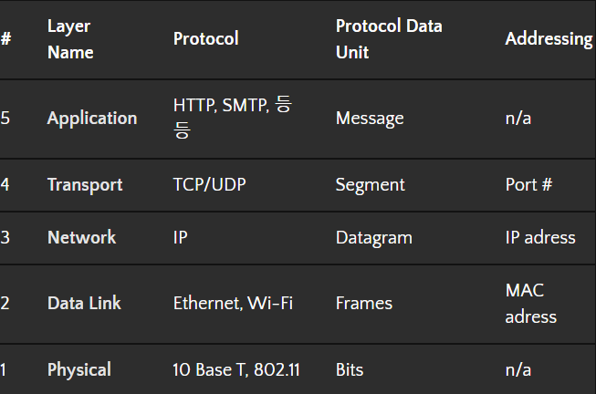

# TCP/ IP
데이터가 의도된 목적지에 닿을 수 있도록 보장해주는 통신규약이다.
TCP와 IP로 이 2가지 포로토콜로 이루어져 있다.

# TCP (Transmission Control Protocol)
두 호스트가 교환하는 데이터와 승인 메세지의 형식을 정의하여, 서버와 클라이언트간의 데이터를 신뢰성있게 전달하기 위해 만들어진 규약이다.
컴퓨터와 컴퓨터를 이어주는 네트워크는 네트워크 선로를 통해 전달된다. 어떤 선로인지에 따라 데이터를 전달하는 속도와 손실되는 데이터의 양이 달라지는데, 이는 데이터를 전달하는 과정에서 그 순서가 의도하지 않게 뒤바뀌거나 손실이 되어 전달되 수 있음을 뜻한다.

TCP는 데이터 데이터 패킥에 일련의 번호를 부여하여 데이터 손실을 찾아내어 수정하고 순서를 재조합하여 클라이언트에게 전달할 수 있게 해준다.

TCP의 장점은 복잡해서 신뢰성이 높다는 점이다.

## 단점
* 데이터로 보내기 전에 반드시 연결이 형성되어야 한다.
* 1 : 1 통신망 가능하다.
* 고정된 동신 선로가 최단선(네트워크 길)이 아닐경우 상대적으로 UDP보다 데이터 전송속도가 느림 

# IP (Internet Protocol)
컴퓨터와 컴퓨터간에 데이터를 전송하기 위해서, 각 컴퓨터의 주소가 필요합니다. Internet Protocol은 4바이트로 이루어진 컴퓨터 주소이며, **192.168.9.255**와 같이 3개의 마침표로 나누어진 숫자로 표시된다. IP는 TCP와 달리 데이터릐 재조합이나 손실여부 확인이 불가능하고 오직 호스트간의 통신만을 담당한다.

 

# TCP/IP
TCP/IP는 5계층으로 물리 계층, 데이터 링크 계층, 네트워크 계층, 전송 계층, 어플리케이션 계층 으로 나누어져 있다.

### 물리 계층 (Physical layer)
물리 계층은 말 그대로 컴퓨터를 서로 연결하는 물리적 장치를 의미한다. 물리계층에는 메트워크 케이블의 샤양(specification)뿐만 아니라 데이터가 전송되는 방식도 포함된다.

### 데이터 계층 (Data Link)
데이터 링크계층에서는 물리계층에서 수신되는 신호들을 해석하는 방법을 정의한다. 데이터 링크 계층에는 많은 프로토콜이 존재하고 무선기술이 점점 유명해지고 있지만  가장 널리 쓰이는 프로토콜은 이더넷(Ethernet)이다.

### 네트워크 계층 (Network)
네트워크 계층은 라우터(ROuter)라는 장치를 통해 서로 다른 네트워크가 서로 통신 할 수 있도록 만드는 계층이다. 대표적으로 라우터로 함께 연결된 네트워크 모음이 우리가 알고 있는 인터넷이며, 네트워크 계층을 종종 인터넷 계층이라고도 한다. 이 계층에서 가장 일반적인 프로토콜은 IP이다.

### 전송 계층 (Transport)
네트워크 계층은 두 개의 개별 노드간 데이터를 전송하는 방법을 나타낸다. 전송계층에서는 특정 클라이언트와 서버 프로그램사이에 데이터 통신을 제공한다.
가장 일반적으로 사용되는 프로토콜은 TCP 프로토콜이다.
흔히 TCP와 IP를 같이 묶어 사용하여 TCP/IP를 하나의 용어로 사용 되는데 각각 다른 계픙에서 다른목적을 가진 프로토몰이다.

### 응용 계층 (Application Layer)
이 계층에서는 다양한 프로토콜들이 있고 이 프로토콜들을 이용하여 다양한 서비스를 하는 계층이다

 

# TCP/IP 통신 흐름

TCP/IP로 통신할 때 계층을 순서대로 거쳐 상대와 통신한다. 송신하는 측은 애플리케이션 계층에서부터 내려가고, 수신하는 측은 네트워크 계층부터 올라간다.

