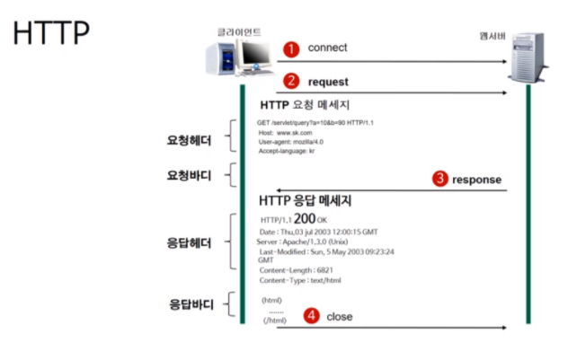
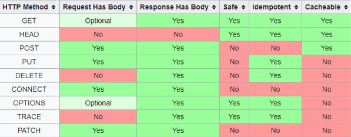

# **HTTP**

## **HTTP란?**

* HTTP란 *Hyper Text Transfer Protocol*의 약자로 TCP/IP를 기반으로 서버와 클라이언트가  인터넷 상에서 데이터(동영상, 이미지, 텍스트(하이퍼텍스트(HTML))문서 등)들을 주고 받기 위해 사용된 통신 규약이다.

## **HTTP 특징**
* **TCP(Transmission Comtrol Prorocol) / IP(Internet Portocol)를 이용하는 응용 프로토클이다.**

## **HTTP 작동방식**

1. **HTTP는 서버/클라이언트 모델을 따른다.**

    클라이언트가 서버에게 요청을 보내면, 서버가 요청을 받아 클라이언트에게 응답을 보낸다.

2. **HTTP는 무상태(Stateless) 프로토콜이다.**

    각 요청을 독립적인 트랜잭션(Transaction)으로 취급한다는 뜻이다. 그래서 클라이언트가 서버에게 요청을 보내기 전에, 클라이언트와 서버를 연결하는 과정이 필요하다. 서버는 응답을 한 후에 클라이언트와의 연결을 끊는다.

    

여기서 작동방식에 의한 장단점이 있는데 
* **장점**
  
    * 클라이언트와 서버가 계속 연결된 형태가 아니기 때문에, 클라이언트와 서버 간의 최대 연결 수보다 휠씬 더 많은 요청과 응담을 처리 할 수 있다.
  
    * 그래서 불특정 다수를 대상으로 하는 서비스에 적합하다고 할 수 있다.

* **단점**
  
    *  서버가 응답 후 클라이언트 와의 연결을 끊어버려, 요청이 들어오는 클라이언트의 이전 상황을 알 수 없다.

* 그래서 이를 해결하기 위해 나온것이 **쿠키**(cookie)다.

    쿠키는 간단히 말해, 사용자가 웹사이트를 방문할 경우 그 사이트의 서버를 통해 인터넷 사용자의 컴퓨터에 설치되는 작은 기록 정보 파일이다.

## **HTTP 메소드**

**HTTP** 메소드는 클라이언트와 서버 사이에 이루이지는 요청(request)와 응담(response) 데이터를 전송하는 방식. 쉽게 이야기 하자면 **서버에 요청을 보내는 방법**이다.

### **종류**

1. get
    
    리소스를 검색하고, 반환받기 위해 사용되는 메소드이다.
    원하는 정보를 서버에 요청할 때 쓰인다.
    (일반적으로) 리소스의 위치를 URL에서 쿼리로 표현하기 때문에 RequestBody가 없다.

2. HEAD
    
    서버에 각종정보를 확인하기 위해 샤용되는 메소드이다.
    GET과 동일하지만, response에 Body가 없고 response Code와 Head만 응답받는다.

3. POST

    요청된 자원을 생성하기 위해 사용되는 메소드이다.
    POST로 정보를 전송하면 URL에 파라미터가 나타나지 않으므로 각종 데이터를 전송하는데 쓰인다.

4. PUT
    
    요청된 자원을 수정하기 위해 사용되는 메소드이다.

5. PATCH

    요청된 자원을 수정하기 위해 사용되는 메소드라는 점에서 PUT과 같지만, 해당 자원 전체를 수정하는 PUT과 다르게 PATCH는 해당 자원의 일부만 수정한다.

6. DELETE

    요청한 자원을 삭제하기 위해 사용되는 메소드이다.
    클라이언트에서 서버의 자원을 삭제할 수 있도록 허가하는 것은 매우 위험하다.
    그러므로 현실적으로는 사용될일이 거의 없고, 대부분의 서버는 이 메소드를 비활성화 시킨다.

7.  CONNECT
    
    프록시 기능을 요청할 때 사용되는 메소드이다.

