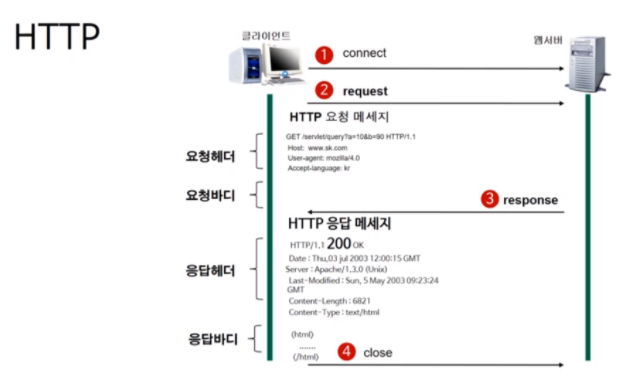

# **HTTP**

## **HTTP란?**

* HTTP란 *Hyper Text Transfer Protocol*의 약자로 TCP/IP를 기반으로 서버와 클라이언트가  인터넷 상에서 데이터(동영상, 이미지, 텍스트 등)들을 주고 받기 위해 사용된 통신 규약이다.

## **HTTP 작동방식**

1. **HTTP는 서버/클라이언트 모델을 따른다.**

    클라이언트가 서버에게 요청을 보내면, 서버가 요청을 받아 클라이언트에게 응답을 보낸다.

2. **HTTP는 무상태(Stateless) 프로토콜이다.**

    각 요청을 독립적인 트랜잭션으로 취급한다는 뜻이다. 그래서 클라이언트가 서버에게 요청을 보내기 전에, 클라이언트와 서버를 연결하는 과정이 필요하다. 서버는 응답을 한 후에 클라이언트와의 연결을 끊는다.

    

여기서 작동방식에 의한 장단점이 있는데 
* **장점**
  
    * 클라이언트와 서버가 계속 연결된 형태가 아니기 때문에, 클라이언트와 서버 간의 최대 연결 수보다 휠씬 더 많은 요청과 응담을 처리 할 수 있다.

    * 그래서 불특정 다수를 대상으로 하는 서비스에 적합하다고 할 수 있다.

* **단점**
  
    *  서버가 응답 후 클라이언트 와의 연결을 끊어버려, 요청이 들어오는 클라이언트의 이전 상황을 알 수 없다.

* 그래서 이를 해결하기 위해 나온것이 **쿠키**(cookie)다.

    쿠키는 간단히 말해, 사용자가 웹사이트를 방문할 경우 그 사이트의 서버를 통해 인터넷 사용자의 컴퓨터에 설치되는 작은 기록 정보 파일이다.

